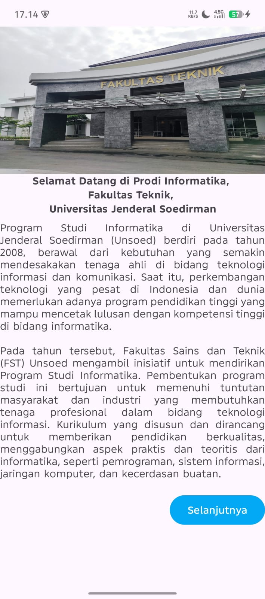
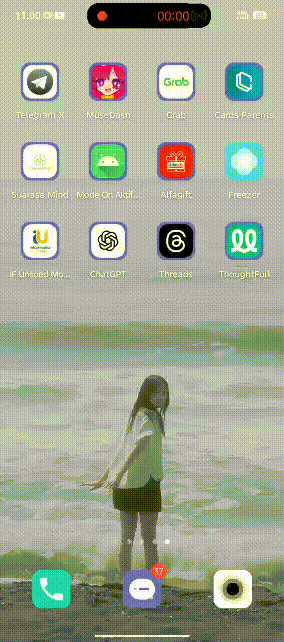

# Tugas 1 - Praktikum Pemrograman Mobile Pertemuan 2

**Identitas Diri**

Defit Bagus Saputra  
H1D023036  
Shift C (Lama) / Shift F (Baru)

**Tampilan Aplikasi (Screenshot)**

# Tugas 2 - Praktikum Pemrograman Mobile Pertemuan 3

## Pertemuan 3
**Demo Aplikasi (GIF/Video)**  
Utamanya memperlihatkan perpindahan halaman

# Tugas 3 - Praktikum Pemrograman Mobile Pertemuan 4

## Pertemuan 4
**Demo Aplikasi (GIF/Video)**  
Memperlihatkan List Data API

